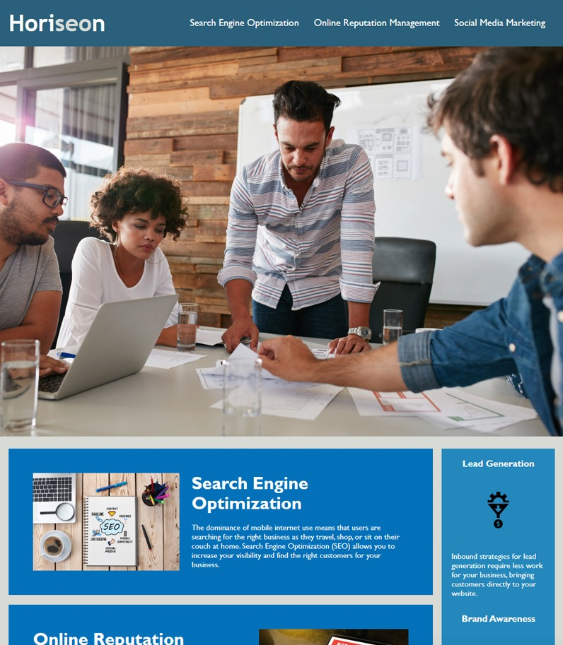

# HoriseonSocialSolutionServices

## Description

What I've done was changed the tags that weren't as descriptive, essentially
adding semantic html tags in order to make the user experience much easier
to natvigate through the page. In additon to have added the semantic tags
alt desciptions weere added as well for pictures that don't load or for the visually impaired.

## User Story

AS A marketing agency
I WANT a codebase that follows accessibility standards
SO THAT our own site is optimized for search engines

## Acceptance Criteria

GIVEN a webpage meets accessibility standards
WHEN I view the source code
THEN I find semantic HTML elements
WHEN I view the structure of the HTML elements
THEN I find that the elements follow a logical structure independent of styling and positioning
WHEN I view the icon and image elements
THEN I find accessible alt attributes
WHEN I view the heading attributes
THEN they fall in sequential order
WHEN I view the title element
THEN I find a concise, descriptive title

## Usuage

Direct to the following link:
https://andreyshes.github.io/HoriseonSocialSolutionServices/

## Visuals

## Credits 

Made with ❤️ by Horiseon Social Solution Services, Inc.

